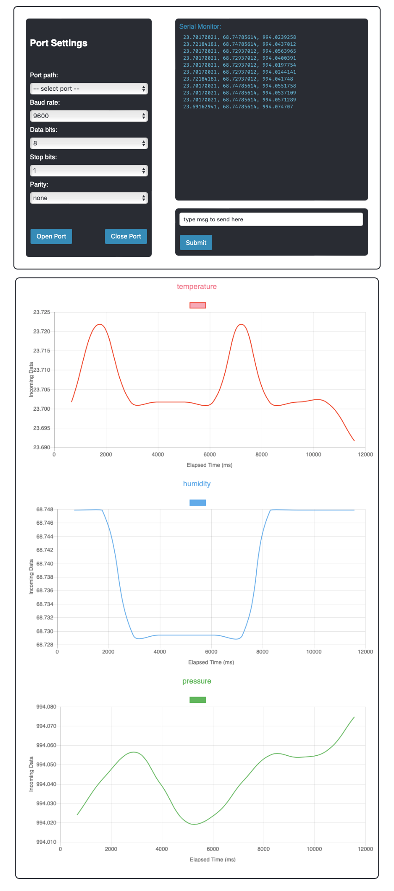

# SerialPort Manager and Data Visualizer

This project is a Node.js application for communicating with serial ports and visializing incoming JSON data. It is particularly useful for anyone working with microcontrollers like the Arduino to read data from a serial port, parse it, visualize it using a line chart can be very useful for monitoring and analyzing data in real-time. Users can select various serial port properties, such as baud rate, data bits, stop bits, and parity, and see incoming data on a line chart and a terminal window.

## Features

- List available serial ports - identifies device connected names.
- Easy select and config serial port connection(baud rate, data bits, stop bits, parity).
- Open/Close the serial port connection.
- Parse incoming JSON data.
- Integrated Serial Monitor
- Ability to type and send data via serial.
- Visiualize incoming data on up to 3 charts.
- Automatic labeling of charts based on received JSON keys.



## Prerequisites

Before running the application, make sure you have the following prerequisites installed on your system:

- Node.js (version 14 or above)
- NPM (Node Package Manager)

## Dependencies

This project uses the following dependencies:

- Express: A web framework for Node.js
- Socket.IO: A library for real-time web applications
- erialPort: A library for serial port communication
- Chart.js: A JavaScript library for creating charts and graphs

## Installation

1. Clone the repository:

   ```bash
   git clone https://github.com/manokel01/serial-monitor-node-ajax.git
    ```

2. CNavigate to the project directory:

   ```bash
   cd serial-monitor-node-ajax
    ```
3. Install the dependencies:
   ```bash
   npm install
    ```

## Usage

1. Connect you microcontroller to the serial port.
2. Make sure it sends up to 3 values in  single JSON per line.
3. Start the application:
   ```bash
   node app.js
   ```
4. Open your web browser and visit http://localhost:3000.
5. Select the desired serial port from the dropdown menu.
6. Configure the serial port properties (baud rate, data bits, stop bits, parity).
7. Click the "Open Port" button to establish a connection with the selected serial port.
8. Once the port is opened, you will see the received data displayed in real-time on the webpage.
9. To close the port connection, click the "Close Port" button.

## Contributing

Contributions to the SerialPort Communication Web App are welcome! If you find any bugs or have suggestions for improvements, please open an issue or submit a pull request.

## License

This project is licensed under the MIT License.

## Acknowledgements

- Express - Fast, unopinionated, minimalist web framework for Node.js
- SerialPort - Node.js package for serial port communication
- Socket.IO - Real-time bidirectional event-based communication library